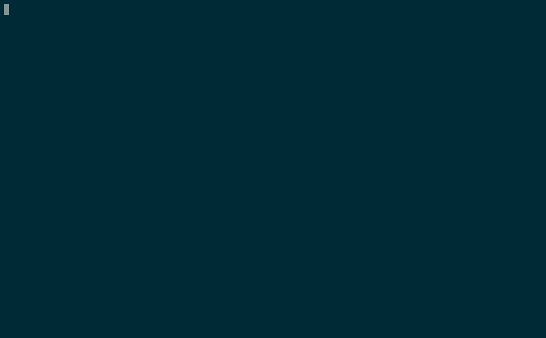

3llo - The interactive CLI application for Trello
================

3llo allows you to work with Trello without exiting your favorite terminal.



3llo was inspired by the awesome
[rainbowstream](https://github.com/DTVD/rainbowstream) and
[facy](https://github.com/huydx/facy).

## Installation

```ruby
gem install 3llo
```

Run `3llo --configure` and follow the instructions to complete the set up.

## Usage

### "board" command family

Just like the web version of Trello, you need to select a board:

```
3llo  > board list

[123abc000000000000000001 #1] - Weekend TODOs
[123abc000000000000000002 #2] - 3llo project
[123abc000000000000000003 #3] - Grocery list

3llo > board select #2

Board Work stuff selected
```

Please note that you can also access any entities with their Trello ID.

```
3llo > board select 123abc000000000000000002

Board Work stuff selected
```

### "list" command family

Executing `list list` will list all the lists in the board.

```
3llo > list list

[123abc000000000000000001 #1] To Do
[123abc000000000000000002 #2] Doing
[123abc000000000000000003 #3] Pending
[123abc000000000000000004 #4] Done
```

`list cards <list_key>` will list all the cards.

```
3llo > list cards #1

[123abc000000000000000001 #1] Merge card editing command
[123abc000000000000000002 #2] Refactor code
...
```

### "card" command family

"card" command family comes with many commands to work with cards.

To list all the cards in the board, run `card list`.

```
3llo > card list

#To Do
======
[123abc000000000000000001 #1] Merge card editing command [#small]
[123abc000000000000000002 #2] Refactor code [#medium] [@qcam]


#Doing
======
[123abc000000000000000003 #3] Release v1.0 [#release] [@qcam]

#Pending
...
```

You can also list cards that have been assigned to you with `card list mine`.

```
3llo > card list mine

[123abc000000000000000002 #2] (To Do) Refactor code
[123abc000000000000000003 #3] (Doing) Release v1.0
```

To view a card in detail, `card show <card_key>` is your friend.

```
3llo > card show #2

Refactor code
[123abc000000000000000002 #2]
Link: https://trello.com/c/AbCdEfG

Things to do [123abc000000000000000001 #1]
[ ] Item 1 [123abc000000000000000001 #1]
[ ] Item 2 [123abc000000000000000002 #2]
[ ] Item 3 [123abc000000000000000003 #3]
[ ] Item 4 ...
```

Want to comment on a card? Run `card comment <card_key>`.

```
3llo > card comment #2

Comment: (Press CTRL-D or CTRL-Z to finish)
What else should we refactor more?<enter>

Comment has been posted

3llo > card comments #2

@just_another_person_on_the_internet on <Jan 01, 2020 00:55:55> wrote:
This card is awesome!

@qcam on <Jan 01, 2020 00:55:55> wrote:
What else should we refactor more?
```

## Contributing

Bug reports and pull requests are welcome on GitHub at https://github.com/qcam/3llo.

### "3llo" sounds odd to me. Where did the name come from?

It might be interesting to know that `3 == "tre"` in Swedish 🇸🇪.

## License

MIT
